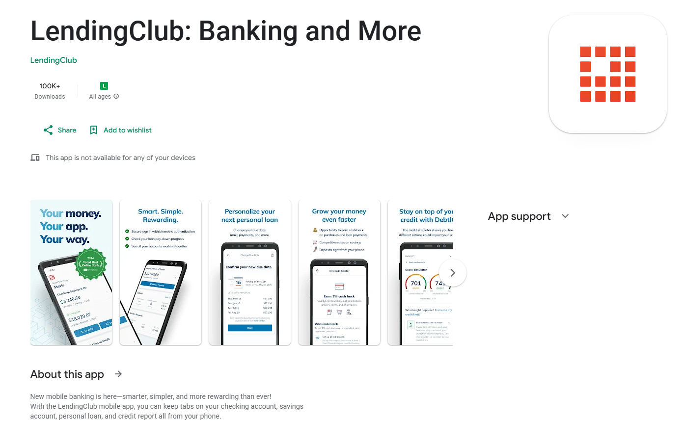
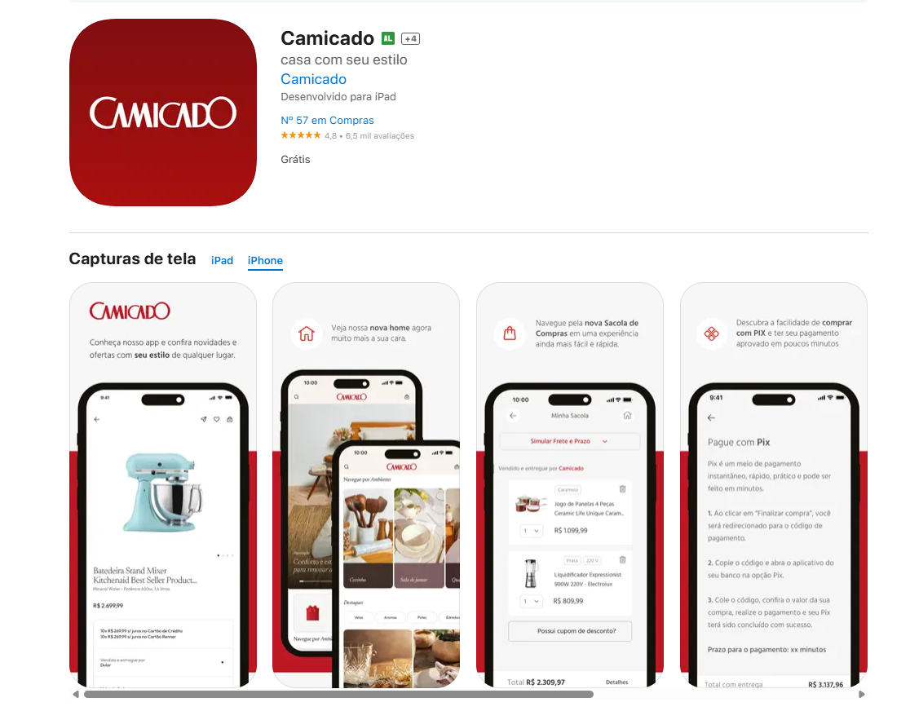
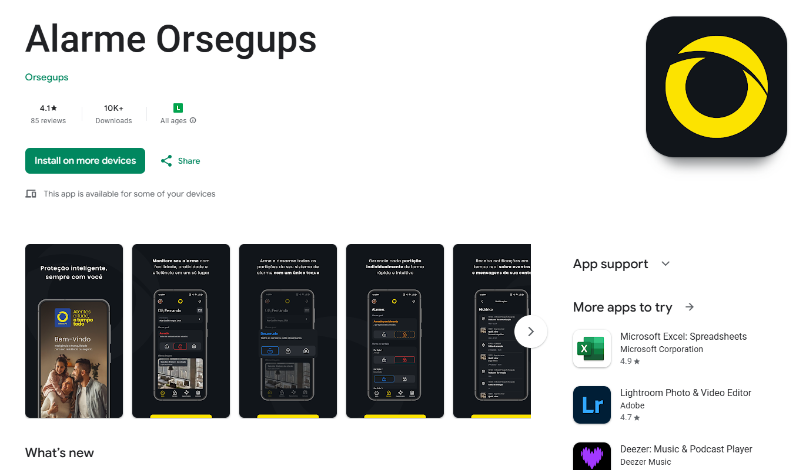

A selection of professional projects I have contributed to as a **Frontend & Mobile Software Engineer**, showcasing work in **React, React Native, Angular, Node.js, and cloud-native development**.

## LendingClub (Fintech – USA)

**Role:** Frontend & Mobile Software Engineer  
**Period:** Dec 2021 – Present  
**Overview:**

- Developed and maintained **web and mobile apps** for LendingClub’s financial products.
- Focused on **React, React Native, Node.js**, testing with **Jest & Testing Library**.
- Delivered cross-platform features for **iOS and Android**.
- Improved performance and frontend architecture.  
  **Image:**   
  **Links:** [LendingClub Website](https://www.lendingclub.com)

---

## Camicado (E-commerce – Brazil)

**Role:** Frontend & Mobile Developer (ilegra)  
**Period:** Jun 2021 – Dec 2021  
**Overview:**

- Built **React Native features** for Camicado’s e-commerce app.
- Integrated **payment APIs** and vendor services.
- Developed **AR/3D product visualization**.
- Managed state with **Redux** and React hooks.  
  **Image:**   
  **Links:** [Camicado Website](https://www.camicado.com.br)

---

## Thomson Reuters – OnBalance (Accounting SaaS – Global)

**Role:** Frontend Developer (ilegra)  
**Period:** Jan 2021 – Jun 2021
**Overview:**

- Maintained and added features to **AngularJS apps**.
- Participated in migration to **modern Angular**.
- Delivered accounting SaaS features used worldwide.
- Focused on **code quality and client-focused solutions**.
  <!-- **Image:**    -->
  **Links:** [Thomson Reuters Website](https://www.thomsonreuters.com)

---

## Orsegups (Security Solutions – Brazil)

**Role:** Frontend Developer (ilegra)  
**Period:** Nov 2019 – Jan 2021  
**Overview:**

- Built **web and mobile apps from scratch** using **React, React Native, Node.js, Firebase, TypeScript**.
- Designed **frontend architecture and design systems**.
- Delivered apps to **App Store & Play Store**.
- Created **BFF services** and automated testing.  
  **Image:** 
  **Links:** [Orsegups Website](https://www.orsegups.com.br/alarme-365-voce-muito-mais-seguro/)

---
