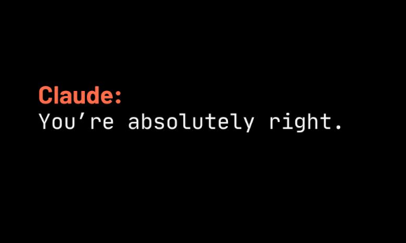

Something funny happened at work recently that made me rethink the whole "AI agents replacing engineers" narrative.

I had just finished building a set of features using Claude Opus 5. The code was solid, well-structured, and passed all tests. Then a colleague ran an automated PR review skill powered by a Sonnet model. The result? A flood of "critical issues" flagged across the codebase.

One or two were legitimate—fair enough. But the rest? Pure hallucinated risk. Suggestions to add guardrails for edge cases that would **never** happen in our context. Defensive checks against scenarios that contradict the very architecture we built. It was like having a paranoid auditor who never read the design docs but still felt confident enough to rewrite the spec.

## Two Models, Two Realities

This is the part that should make every engineer pause. The same company, the same product family, two different model tiers—and completely different assessments of the same code. Opus wrote it. Sonnet reviewed it. And Sonnet found "problems" that Opus (and any human reading the code) would dismiss as fiction.

It's not that one model is "wrong" and the other "right." The issue is deeper: **models have different risk profiles, different training biases, and different thresholds for what they consider "dangerous."** Opus leans toward generating confident, complete solutions. Sonnet, especially in review mode, tends to be more conservative—sometimes to the point of manufacturing problems that don't exist.

> When two AI models disagree about the quality of the same code, who breaks the tie? If the answer is "nobody," we have a problem.

## The Missing Judge

Here's what bothers me: in this back-and-forth between models, **the engineer was nowhere in the loop**. The review happened, the comments were generated, and without a human critically evaluating whether those suggestions made sense, they could have easily been merged—adding unnecessary complexity, phantom guardrails, and code that solves imaginary problems.

We are building a future where AI writes code, AI reviews code, AI suggests fixes, and AI approves the fixes. At what point does the human engineer become a rubber stamp? And more importantly: **what happens when the rubber stamp stops paying attention?**

## The Vibe Coder Trap

This is the slippery slope I see more and more:

1. AI generates a feature → looks good, merge it.
2. AI reviews the feature → flags issues → fix them.
3. AI suggests the fix → looks reasonable, merge it.
4. Repeat until nobody actually understands the codebase.

Welcome to **vibe coding**—where the engineer's role reduces to mediating between AI agents, accepting whatever sounds plausible, and hoping for the best. No deep understanding. No architectural judgment. No critical thinking. Just vibes.

The problem? **AI is still a copilot.** A very capable one, sure. But a copilot nonetheless. It doesn't understand your business context, your team's conventions, your deployment constraints, or the subtle reasons why a certain pattern was chosen over another. It optimizes for what looks correct in isolation, not for what works in the real, messy, interconnected system you're building.

## AI as a Tool, Not a Juror

The dangerous shift happens when we stop treating AI as a **tool** and start treating it as an **authority**. A tool is something you use to accelerate your own judgment. An authority is something you defer to instead of exercising judgment.

When an AI review tool flags an issue, the right response is not "fix everything it says." The right response is: **"Interesting. Let me evaluate whether this is real."**

When an AI generates code, the right response is not "looks good, ship it." The right response is: **"Let me understand what it did, why, and whether it fits the bigger picture."**

This is not optional. This is the core of engineering responsibility in the age of AI.

## Practical Guardrails for Engineers

How do I stay the pilot, not the passenger?

### 1. Every AI Suggestion Gets a Human Verdict

No code enters the codebase without an engineer understanding and approving it. Period. If an AI review tool flags 10 issues, I evaluate all 10 myself. Maybe 2 are valid. The other 8 go in the trash—respectfully.

### 2. Know Your Models' Personalities

Just like you learn that different teammates have different perspectives, learn that different AI models have different tendencies. Opus generates confidently. Sonnet reviews conservatively. GPT tends toward verbosity. Understand these patterns and calibrate your trust accordingly.

### 3. The "Why" Test

Before accepting any AI suggestion, ask: **Why does this need to change?** If you can't articulate the reason in terms of your actual system's behavior, the suggestion is probably noise.

### 4. Own the Architecture

AI can suggest components. Only you can decide how they fit together. The architectural vision is a human responsibility, and delegating it to a model is the fastest way to create a codebase that nobody—not even the AI—truly understands.

### 5. Periodic "AI Detox" Reviews

Every once in a while, review a PR purely as a human. No AI tools, no copilot suggestions. Just you and the code. It keeps your judgment sharp and reminds you why you're the one in the pilot's seat.

---

## Plot Twist: The Human Had the Last Word

Here's the epilogue to the story I opened with. After Sonnet buried my PR in phantom issues, I did something radical: **I responded to every single comment.**

Line by line, I explained why each "critical" suggestion was unnecessary. "This edge case never happens because of X." "This guardrail is redundant because the architecture already handles it at layer Y." "This check contradicts the contract defined by Z." I wasn't being dismissive—I was being an engineer.

My colleague then took my responses and fed them back into Sonnet for a second review. And the result? The model flipped on its own previous assessment. Issues were retracted. Comments were marked as resolved. The PR was approved.

I don't know exactly what the model said, but I have a pretty good guess it was something along the lines of _"You're right, this is fine."_ Just like that—same model, same code, same context, but now it agreed with me because a human had actually articulated the reasoning.

Let that sink in. **The AI agreed with itself being wrong.** Not because the code changed. Not because the context changed. But because a human finally stepped in and provided the judgment that was missing the entire time.

That's the whole point. The model didn't lack intelligence—it lacked **context and conviction.** It was confidently wrong, then cooperatively right. The difference? A human who actually understood the system and wasn't afraid to push back.

## How to Prevent These Problems: A Practical Playbook

Individual awareness is necessary but not enough. The whole team needs to be aligned. Here's what I believe every engineering team should adopt as AI matures in the workflow:

### 1. Establish Shared Design Patterns and Standards _Before_ AI Writes Code

AI doesn't know your conventions. If your team hasn't documented its design patterns, naming conventions, error handling strategies, and architectural principles, the AI is operating blind—and so is every reviewer (human or model). **Your standards are the source of truth.** Make them explicit, keep them updated, and ensure every AI prompt and skill references them.

### 2. Create Team-Wide AI Skills, Agents, and Shared Prompts

This is the moment for teams to stop letting everyone configure their own AI setup. Build **shared review skills**, shared prompt libraries, and standardized agent configurations that everyone uses. A code review skill with the team's context baked in will always outperform a generic one. Everyone reviews from the same playbook.

### 3. Standardize the Base Model Across the Team

If Opus writes code and Sonnet reviews it, you're begging for conflicting assessments. The team should agree on a **standard base model** for generation, review, and debugging. When the writer and the reviewer speak the same "language," the signal-to-noise ratio improves dramatically. Model-specific biases become a team-wide variable you can control.

### 4. Mandate Human Review on All AI-Generated Changes

No PR with AI-generated code gets merged without at least one human who **actually reads and understands it**. This isn't bureaucracy—it's quality assurance. The human reviewer should be able to explain _why_ each change was made, not just confirm that the AI said so.

### 5. Build AI Feedback Loops

When an AI makes a mistake—flags a non-issue, suggests something harmful, misses a real bug—**document it.** Build a team knowledge base of AI failure patterns. Over time, this becomes invaluable context for calibrating prompts, refining skills, and knowing when to trust and when to push back.

### 6. Define "AI Autonomy Zones"

Not all tasks carry the same risk. Be explicit about what AI can do autonomously (e.g., generating boilerplate, suggesting variable names) and what always requires human judgment (e.g., architectural decisions, security-sensitive code, business logic). **Draw the line clearly and revisit it quarterly.**

### 7. Run Retrospectives on AI Usage

Just like you sprint-retrospective on development practices, do the same for AI workflows. What's working? Where is AI adding real value? Where is it creating noise? What prompts or skills need refinement? Treat your AI stack like any other part of your engineering process—it deserves continuous improvement.

### 8. Invest in AI Literacy for the Whole Team

Not everyone on the team has the same level of comfort with AI tools. Run internal workshops. Share tips, prompt patterns, and horror stories. The team that understands AI's strengths and weaknesses _together_ is the team that avoids the vibe coding trap.

---

## The Bottom Line

The AI agents war is real. Models will keep disagreeing with each other, generating contradictory assessments, and producing confident-sounding nonsense alongside genuinely useful insights. That's the nature of probabilistic systems.

The engineer's job hasn't changed—it's just become more critical. **You are the judge, the jury, and the architect.** AI is a powerful assistant that can speed up research, catch some bugs, and suggest alternatives. But it cannot replace the contextual understanding, the trade-off reasoning, and the professional judgment that make software engineering an actual discipline.

The teams that thrive in this new era won't be the ones that use AI the most—they'll be the ones that use it the **wisest.** Standards, shared tools, human oversight, and continuous learning. That's the real stack that matters.

Don't be a vibe coder. Stay in the pilot's seat.
