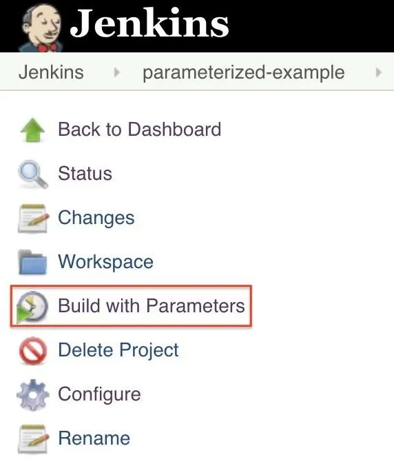
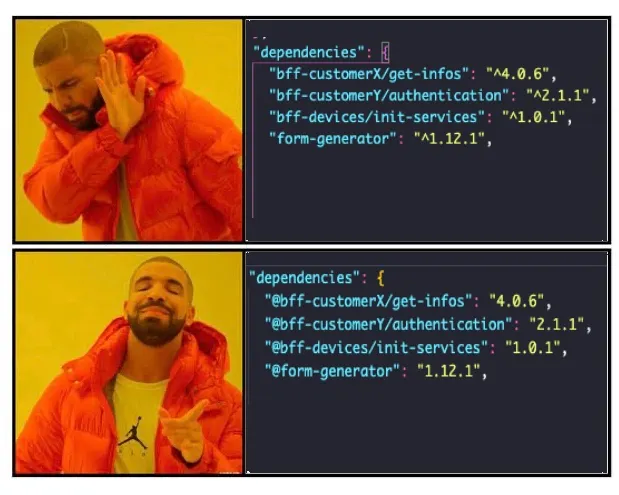

Front-end development often lacks strong security practices. When you search the web for "front-end," most results are about UX/UI, HTML, CSS, and JavaScript. You’ll find some content on testing (unit, snapshot, integration, or performance), but almost nothing about the importance of security in front-end development.

This article aims to share some security best practices that I’ve applied in front-end projects throughout my professional experience.

---

## 1. Hide sensitive information

One of the most important practices is **keeping sensitive information out of your codebase**. This includes not only base URLs, but also:

- Private API keys
- Access tokens
- Secrets required by third-party services
- Any configuration values that should not be exposed in the repository

### How to handle it


The standard approach is to store these values in **environment variables**.

- During development, you can use `.env` files (never commit them to version control).
- In production, inject environment variables securely through your **CI/CD pipeline** (e.g., Jenkins, GitHub Actions, GitLab CI).

This way, sensitive information is not hardcoded or versioned, and values are set only at deploy time, minimizing exposure.



---

## 2. Protect your source code

If you are implementing an internal application for your company, make sure your source code is properly protected. Some recommended practices include:

- Keep your code in **private repositories**.
- Create **private libraries** when sharing code across projects.
- Protect packages and **require authentication** (via `.npmrc`) to install them.
- Use **scoped npm packages** (e.g., `@your-lib`).
- Keep **fixed versions** of dependencies (e.g., `1.0.2` instead of `^1.0.2`).



### Why does this matter?

If your code is exposed, attackers can easily see all the dependencies in your `package.json`, as well as other sensitive information (URLs, private keys, etc., if not already hidden as mentioned above).

Always update packages manually. For public libraries, carefully check release notes, issues, and changelogs before upgrading, to avoid breaking changes.

---

## 3. Prevent “Dependency Confusion” attacks

If attackers discover the names of your packages and you don’t use **scopes** or **fixed versions**, they can launch an attack known as **Dependency Confusion**.

In this attack, a malicious actor publishes a package with the **same name as yours** but with a **higher version number**. If your package has no scope and no fixed version, npm will install the attacker’s package instead of yours — potentially infecting your machines and even taking your system offline.

A well-documented case of this is the article:

> [Dependency Confusion: How I Hacked Into Apple, Microsoft, and Dozens of Other Companies](https://medium.com/@alex.birsan/dependency-confusion-4a5d60fec610)

---

## 4. Secure your endpoints with tokens

Another essential layer of security is to **protect your URLs with token requirements** (e.g., `accessToken` and `refreshToken`).

Even if one of your base URLs is accidentally exposed, tokens allow you to verify whether the client is properly authenticated before accessing an endpoint.

### Example with Axios interceptors

A recommended way to implement this on the front-end (once your back-end is ready) is by using **Axios interceptors**.

```javascript
import axios from "axios";

const api = axios.create({
  baseURL: process.env.API_URL,
});

api.interceptors.request.use(
  async (config) => {
    const token = localStorage.getItem("accessToken");
    if (token) {
      config.headers.Authorization = `Bearer ${token}`;
    }
    return config;
  },
  (error) => Promise.reject(error)
);

export default api;
```

Interceptors act like a proxy — a “pre-request” step that checks for valid tokens before sending the actual request. If validation fails, the request is blocked.

## 5. Use a private Artifactory/registry

For companies, another important practice is to avoid relying solely on the public npm registry. Instead, set up a private Artifactory/registry (e.g., JFrog Artifactory, Verdaccio, GitHub Packages, AWS CodeArtifact).

Benefits of a private registry:

- Control over which packages are allowed in your environment.

- Cache and mirror public packages to reduce downtime if npm is unavailable.

- Audit and approve dependencies before they reach production.

- Prevent malicious injections by ensuring only verified packages enter your ecosystem.

- Version control for internal libraries, keeping them consistent across teams.

This approach provides greater supply chain security and ensures that even if public npm is compromised, your builds remain safe and stable.

---

## Conclusion

By following security best practices in front-end development, you can deliver **more reliable and higher-quality software** to your clients.

Explore the reference links, run small POCs, and test these ideas in your projects. If you have questions or suggestions, feel free to share them — I’ll be happy to respond.
